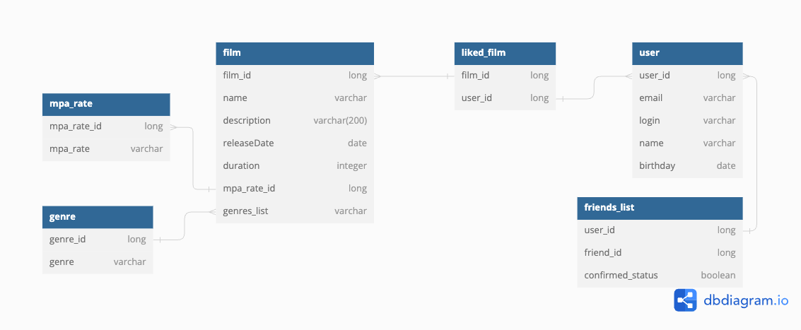

# java-filmorate

## Диаграмма БД

### Описание диаграммы для java-filmorate

- Таблицы **film** / **user** исходные.
- Таблица **liked_film** хранит список лайков пользователей для каждого фильма;
- Таблица **friends_list** хранит информацию о списке друзей и статусе дружбы;
- Таблица **mpa_rate** хранит список возможных рейтингов;
- Таблица **genre** хранит всех список возможных жанров;